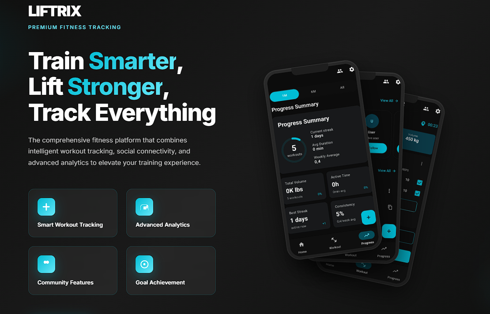
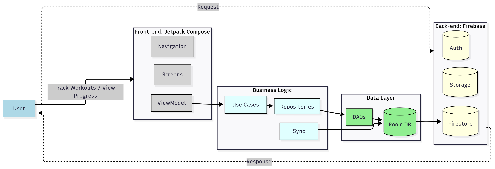
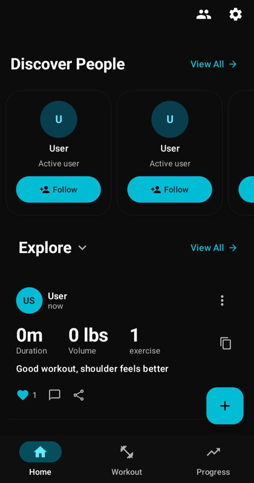
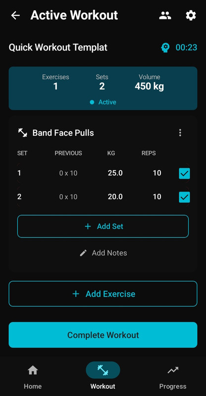
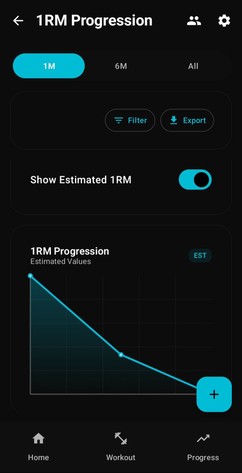
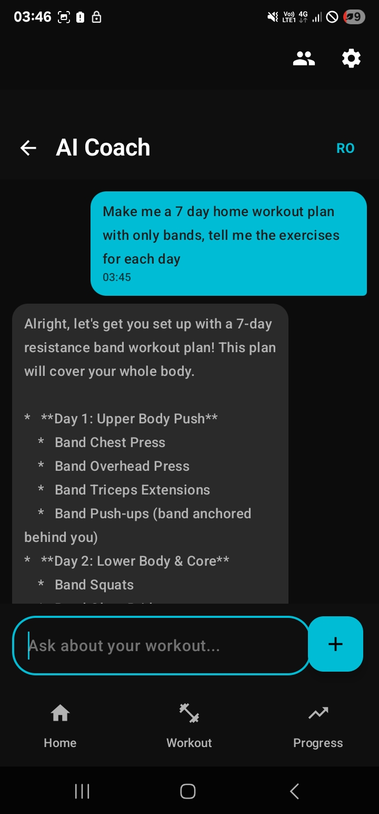

<div align="center">
  
# 💪 Liftrix

### Enterprise-Grade Fitness Tracking Platform with AI Coaching & Social Engagement

[](https://developer.android.com)
[](https://kotlinlang.org)
[](https://developer.android.com/studio/releases/platforms#7.0)
[](https://developer.android.com/studio/releases/platforms)
[](LICENSE)

[](https://developer.android.com/jetpack/compose)
[](https://firebase.google.com)
[](https://developer.android.com/topic/architecture)
[](https://developer.android.com/topic/architecture/data-layer/offline-first)



*Transform your fitness journey with intelligent workout tracking, AI-powered coaching, and social motivation*

[**📱 Screenshots**](#-screenshots) • [**🚀 Quick Start**](#-quick-start) • [**📖 Documentation**](#-documentation)

</div>

---

## ✨ Overview

**Liftrix** is a comprehensive Android fitness platform that combines personal workout tracking with social engagement and AI-powered insights. Built with enterprise-grade architecture patterns, it delivers a premium fitness experience through offline-first design and real-time synchronization.

### 🎯 Key Highlights

- **📱 Modern UI**: 100% Jetpack Compose with Material 3 design system
- **🔄 Offline-First**: Room database as source of truth with Firebase sync
- **🤖 AI Integration**: Chat bot for intelligent coaching
- **👥 Social Features**: Privacy-first feed system with engagement tracking
- **📊 Advanced Analytics**: 8 specialized widgets with 60fps chart rendering
- **🔐 Security**: User-scoped data isolation and privacy controls

---
## 🔒 Closed Source

**Liftrix** is closed source because the app includes premium features that support ongoing development.The github repository exists for *documentation, releases, and issue tracking*, not for code contributions 

---

## 🎨 Features

<table>
<tr>
<td width="50%">

### 💪 Workout Management
- ⏱️ Real-time session tracking
- 📈 Progressive overload support
- 🎯 100+ exercise library
- ✏️ Custom exercise creation

</td>
<td width="50%">

### 📊 Progress Analytics
- 📉 Volume analysis with bezier curves
- 🗓️ Frequency heatmaps
- 📱 Responsive dashboard

</td>
</tr>
<tr>
<td width="50%">

### 👥 Social Engagement
- 💬 Real-time comments & likes
- 🏋️ Gym buddy QR pairing
- 🎉 PR celebrations
- 🔒 Three-tier privacy controls

</td>
<td width="50%">

### 🤖 AI Coaching
- 💭 Context-aware fitness guidance
- 📝 Workout plan generation
- 🎯 Form correction suggestions
- 📊 Performance insights

</td>
</tr>
</table>

---

## 🚀 Quick Start

### Prerequisites

- **Android Studio** Jellyfish (2023.3.1) or later
- **JDK 17+** (OpenJDK recommended)
- **Android SDK** API 34
- **8GB RAM** minimum (16GB recommended)

### Installation

**Option 1**: Download APK (Recommended)

Download the latest APK from the Releases page
Enable "Install from Unknown Sources" in your Android settings
Install the downloaded APK file
Launch Liftrix and complete the initial setup

**Option 2**: Google Play Store
Coming soon - currently in review process

---

## 🏗️ Architecture

<div align="center">

</div>

### Clean Architecture Layers

```
UI Layer (Jetpack Compose)
    ↓ StateFlow<UiState<T>>
ViewModel Layer (MVI Pattern)
    ↓ LiftrixResult<T>
Use Case Layer (50+ Operations)
    ↓ Domain Models
Repository Layer (16 Interfaces)
    ↓ Flow<Entity>
DAO Layer (28 DAOs)
    ↓ SQL Queries
Room Database (29 Entities)
    ↓ Background Sync
Firebase Services (8 Integrated)
```

### Key Architectural Patterns

- **🎯 MVVM with MVI**: Unidirectional data flow with event handling
- **🔒 User Scoping**: Mandatory userId filtering for data security
- **🔄 Offline-First**: Room as single source of truth
- **⚡ Type-Safe Navigation**: Serializable routes with compile-time safety
- **💉 Dependency Injection**: 22 Hilt modules for clean separation

---

## 🛠️ Tech Stack

<table>
<tr>
<td align="center" width="96">

<br>Kotlin
</td>
<td align="center" width="96">

<br>Compose
</td>
<td align="center" width="96">

<br>Firebase
</td>
<td align="center" width="96">

<br>Android
</td>
<td align="center" width="96">

<br>Hilt
</td>
<td align="center" width="96">

<br>Room
</td>
</tr>
</table>

### Core Dependencies

| Category | Technologies |
|----------|-------------|
| **UI Framework** | Jetpack Compose, Material 3, Navigation Compose |
| **Architecture** | MVVM, MVI, Clean Architecture, Repository Pattern |
| **Database** | Room (29 entities), Firestore (offline-first) |
| **Networking** | Firebase Services, Retrofit, OkHttp |
| **DI Framework** | Hilt (22 modules), Dagger |
| **Async** | Kotlin Coroutines, Flow, StateFlow |
| **Testing** | JUnit, MockK, Turbine, Compose Testing |
| **Background** | WorkManager, Firebase Cloud Messaging |

---

## 📊 Performance Metrics

<table>
<tr>
<th>Metric</th>
<th>Target</th>
<th>Status</th>
</tr>
<tr>
<td>UI Rendering</td>
<td>60fps</td>
<td>✅ Achieved</td>
</tr>
<tr>
<td>Database Queries</td>
<td><100ms</td>
<td>✅ Optimized</td>
</tr>
<tr>
<td>Sync Operations</td>
<td><5s</td>
<td>✅ Efficient</td>
</tr>
<tr>
<td>Component Interactions</td>
<td>150ms</td>
<td>✅ Responsive</td>
</tr>
<tr>
<td>Memory Usage</td>
<td>Adaptive</td>
<td>✅ Memory-aware</td>
</tr>
<tr>
<td>Accessibility</td>
<td>WCAG 2.1 AA</td>
<td>✅ Compliant</td>
</tr>
</table>

---

## 📱 Screenshots

<div align="center">
<table>
<tr>
<td></td>
<td></td>
<td></td>
<td></td>
</tr>
<tr>
<td align="center">Home</td>
<td align="center">Workout</td>
<td align="center">Analytics</td>
<td align="center">Coach</td>
</tr>
</table>
</div>

---

## 📖 Documentation

### Core Concepts

- **[Architecture Overview](docs/architecture.md)** - Clean Architecture implementation details
- **[Feature Documentation](docs/features.md)** - Comprehensive feature descriptions
- **[Overview](docs/overview.md)** - Complete overview

### Development Guides

- **[Contributing Guidelines](CONTRIBUTING.md)** - How to contribute
- **[Code of Conduct](CODE_OF_CONDUCT.md)** - Community guidelines

---

## 🗺️ Roadmap

### ✅ Completed
- [x] Core workout tracking system
- [x] Social feed with privacy controls
- [x] AI coaching integration(not yet available to public,testing)
- [x] Progress analytics dashboard
- [x] Offline-first architecture
- [x] QR code gym buddy pairing

### 🚧 In Progress
- [ ] Wearable device integration
- [ ] Video form analysis
- [ ] Nutrition tracking
- [ ] Competition features

### 📋 Planned
- [ ] iOS companion app
- [ ] Web dashboard
- [ ] Advanced AI personalization
- [ ] Multi-language expansion
- [ ] Export to fitness platforms

---

## 📄 License

This project is licensed under the MIT License - see the [LICENSE](LICENSE) file for details.

---

## 🙏 Acknowledgments

- **Firebase Team** for the comprehensive backend services
- **Android Team** for Jetpack Compose and modern Android tools
- **Kotlin Team** for the amazing language and coroutines
- **Open Source Community** for the invaluable libraries
- **Contributors** for making Liftrix better every day

---

## 💬 Community & Support

<div align="center">

[](mailto:valijianu98@gmail.com)

**Found a bug?** [Report Issue](https://github.com/valentin5643/liftrix/issues/new?template=bug_report.md)  
**Have a feature request?** [Request Feature](https://github.com/valentin5643/liftrix/issues/new?template=feature_request.md)  
**Need help?** [Documentation](https://docs.liftrix.app) • [FAQ](https://liftrix.app/faq)

</div>

---

<div align="center">

**Built with ❤️ by the Liftrix Team**

[⬆ Back to Top](#-liftrix)


</div>


